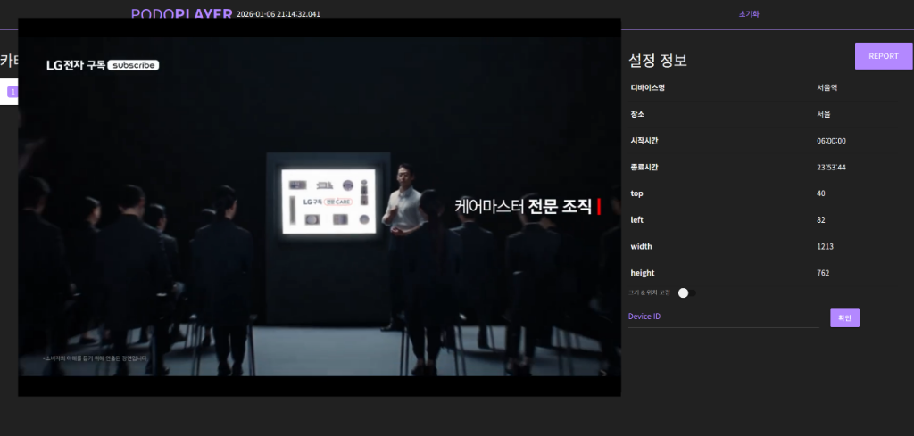

# 광고 네트워크 연동 가이드

Podo Player는 다양한 광고 네트워크(Ad Network)와의 연동을 지원합니다. 모든 외부 광고는 기본적으로 **"다음 비디오 프리로딩(Pre-loading) -> 재생 -> 보고(Reporting) 및 캐시 삭제"**의 생명주기를 가집니다.

## 1. 개요

광고 타입은 `HIVESTACK_YN` 필드값에 따라 결정됩니다.

| 플래그 값 | 네트워크 | 구분 (`HIVESTACK_YN`) | API 필드 (Source URL) | 연동 방식 |
| :--- | :--- | :--- | :--- | :--- |
| **`A`** | **Naver** | `'A'` | `NAVER_URL` | VAST (XML) |
| **`Y`** | **Hivestack** | `'Y'` | `API_URL` | VAST (XML) |
| **`V`** | **Vistar** | `'V'` | `VISTAR_URL` | REST API (JSON) |

---

## 2. 공통 로직 (파일 다운로드 및 캐시 관리)

모든 외부 광고(Hivestack, Vistar, Naver)는 끊김 없는 재생을 위해 **Pre-loading** 메커니즘을 사용합니다.

### 2.1 파일 다운로드 (Pre-loading)
- **시점**: 현재 비디오가 로딩된 직후 (`loadeddata` 이벤트) 또는 스케줄링된 시간 2분 전 (`cronVideo`).
- **동작**:
    1.  현재 재생 중인 비디오의 `loadeddata` 이벤트가 발생하면, `playlist.nextIndex()`를 통해 **다음 재생될 아이템**을 확인합니다.
    2.  다음 아이템이 외부 광고인 경우, 해당 네트워크의 API를 호출하여 메타데이터(비디오 URL, 리포트 URL 등)를 가져옵니다.
    3.  확보한 비디오 URL(`videoUrl`)에 대해 `axios.get(videoUrl)`을 수행합니다.
        -   이 요청은 브라우저/Service Worker 캐시에 비디오 파일을 저장하는 역할을 합니다.
    4.  플레이어의 `source`를 해당 URL로 업데이트하여 재생 준비를 마칩니다.

### 2.2 캐시 삭제
- **시점**: 비디오 재생이 끝나고 `addReport` 함수가 실행되는 시점.
- **동작**: `caches.open(VIDEO_CACHE_NAME)`을 열고, 방금 재생한 비디오 URL을 캐시에서 즉시 **삭제**합니다 (`cachedVideo.delete`). 이는 디바이스 저장 공간을 효율적으로 관리하기 위함입니다.

---

## 3. 네트워크별 상세 로직

### 3.1 Naver (`A`)

- **다운로드 로직**:
    1.  `NAVER_URL` 호출 (URL 끝이 `adt=`라면 타임스탬프 추가).
    2.  XML 응답 파싱 -> `MediaFile` 태그에서 MP4 URL 추출.
    3.  `Tracking` 태그 목록 추출.
    4.  **특이사항**: 메타데이터 파싱 단계(`getUrlFromNaver`)에서 **모든 `Tracking` URL에 대해 즉시 `GET` 요청**을 보냅니다. (재생 시작 시점이 아닌, 다음 비디오 로딩 시점에 트래킹 발생).

- **리포트(Reporting) 로직**:
    -   네이버는 별도의 `reportUrl`을 반환하지 않으며(`null` 처리), 위에서 언급한 `Tracking` URL 호출로 노출 집계가 완료된 것으로 간주합니다.
    -   플레이어 내부 DB 보고: `reportUrl`이 없으므로 성공으로 간주하고, 내부 Dexie DB(`db.reports`)에 재생 기록을 저장합니다.
    -   **실패 방어 로직 (Defensive Logic)**:
        -   **외부 트래킹**: `getUrlFromNaver` 함수 내에서 트래킹 URL 호출 시 `catch` 블록이 존재하여, 호출 실패 시 **에러를 로그(`console.log`)만 남기고 무시**합니다. 별도의 재시도(Retry) 로직은 없으며, 프로그램 실행(재생)에는 영향을 주지 않도록 설계되어 있습니다 ("Fire and Forget").
        -   **내부 저장**: 외부 트래킹 성공 여부와 관계없이, `addReport` 함수에서는 항상 `shouldSaveReport = true`로 처리되어 내부 DB에는 안전하게 기록됩니다.

### 3.2 Hivestack (`Y`)

- **다운로드 로직**:
    1.  `API_URL` 호출. 실패 시 최대 3회 재시도.
    2.  XML 파싱 -> `MediaFile` (비디오), `Impression` (리포트/트래킹) 추출.
    3.  추출된 URL로 비디오 프리로딩.

- **리포트(Reporting) 로직**:
    -   **시점**: 비디오 재생 종료(`ended` 이벤트) 후 `addReport` 호출 시.
    -   **동작**: 파싱해둔 `Impression` URL(`reportUrl`)로 `axios.get` 요청을 보냅니다.
    -   **결과 처리**: 요청의 성공/실패 여부와 관계없이(`catch` 블록에서도) 로컬 DB에 재생 기록을 저장합니다 ("Hivestack은 실패해도 저장해야 함" 주석 참조).

### 3.3 Vistar (`V`)

- **다운로드 로직**:
    1.  `VISTAR_URL`로 `POST` 요청 (Body: 파라미터 + `display_time`).
    2.  JSON 응답 파싱 -> `asset_url` (비디오), `proof_of_play_url` (리포트) 추출.
    3.  추출된 URL로 비디오 프리로딩.

- **리포트(Reporting) 로직**:
    -   **시점**: 비디오 재생 종료(`ended` 이벤트) 후 `addReport` 호출 시.
    -   **동작**: `proof_of_play_url`로 `axios.get` 요청을 보냅니다.
    -   **결과 처리**: 응답 코드가 **200 (OK)** 인 경우에만 로컬 DB에 재생 기록을 저장합니다. 200이 아니면 로그를 남기고 저장하지 않습니다.

---

## 4. 플레이어 내부 보고 (DB Sync)

모든 외부 광고는 로컬 처리가 끝난 후 공통적인 서버 동기화 로직을 따릅니다.

1.  **로컬 저장**: `db.reports.add(report)`를 통해 IndexedDB에 재생 정보를 저장합니다.
2.  **배치 전송 (Batch Sending)**:
    -   `addReport` 실행 시, 저장된 리포트 중 **5분 이상 경과한** 데이터가 있는지 확인합니다.
    -   오래된 데이터가 있다면 `reportAll()`을 호출하여 `db.reports`에 있는 **모든** 기록을 서버(`REPORT_URL`)로 전송(`POST`)하고, 로컬 DB를 비웁니다.

---

## 5. 플레이어 화면 예시

*위 이미지는 플레이어 실행 화면 및 디버그/설정 패널의 예시입니다.*

---

## 6. 시퀀스 다이어그램 (Sequence Diagrams)

상세 시퀀스 다이어그램은 별도 문서를 참고하시기 바랍니다.

- [광고 네트워크 연동 시퀀스 다이어그램 (AD_NETWORKS_DIAGRAMS.md)](AD_NETWORKS_DIAGRAMS.md)
- [Naver 연동 시퀀스 다이어그램 (NAVER_DIAGRAMS.md)](NAVER_DIAGRAMS.md)
