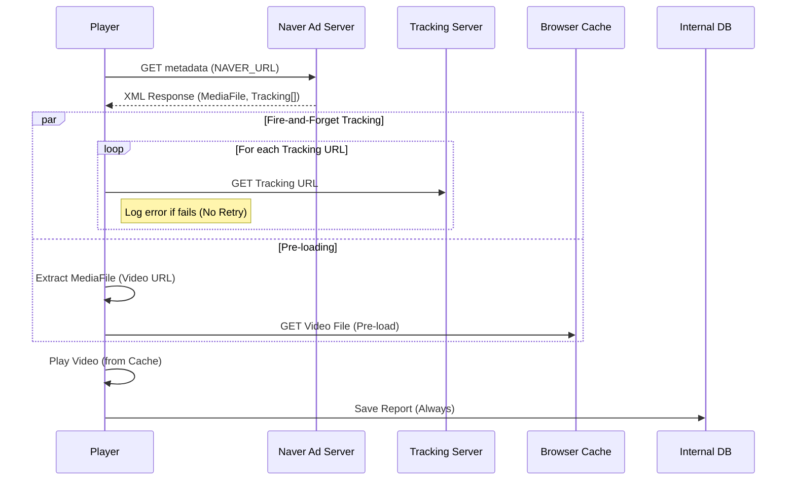
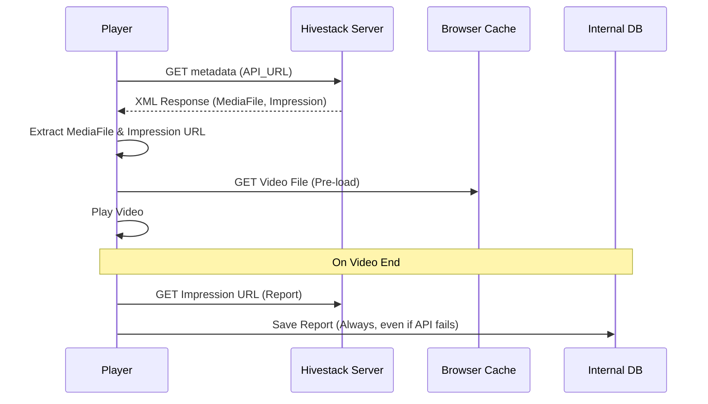
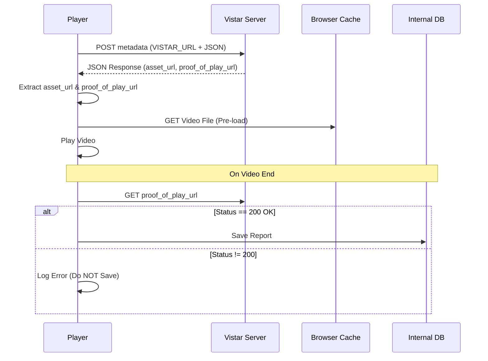

# Sequence Diagrams for Ad Network Integration

이 문서는 Naver, Hivestack, Vistar 광고 네트워크의 연동 시퀀스 다이어그램을 포함합니다.

## 1. Naver (`A`) Flow
- **특징**: 트래킹(Tracking)이 비디오 로딩 시점에 즉시 발생하며(`Fire-and-Forget`), 결과와 무관하게 DB에 저장됩니다.

## 2. Hivestack (`Y`) Flow
- **특징**: 재생 완료 후 리포팅하며, 리포트 전송 성공 여부와 상관없이 DB에 저장됩니다.

## 3. Vistar (`V`) Flow
- **특징**: 재생 완료 후 리포팅하며, **성공(200 OK)시에만** DB에 저장합니다.

