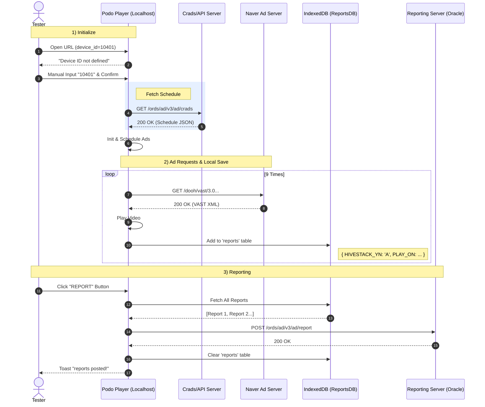

# Device ID 10401 테스트 분석 보고서

## 1. 테스트 개요
- **목적**: `device_id=10401` 환경에서의 플레이어 초기화, 광고 스케줄링(Naver), 및 레포팅 시스템 동작 검증
- **테스트 일시**: 2026-01-06
- **환경**: Localhost (Python SimpleHTTP Server), Chrome Headless

## 2. 초기화 (Initialization)
- **URL**: `http://localhost:8080/index.html?device_id=10401`
- **결과**:
    - URL 파라미터로 자동 초기화 실패 (원인: 코드상 `device_id`와 `company_id`가 모두 필요).
    - **조치**: UI 입력창에 `10401` 수동 입력 후 확인 버튼 클릭.
    - **최종 상태**: 플레이어 정상 초기화 완료 (`[log] player ready`).

## 3. 광고 네트워크 연동 (Ad Networks)
- **Naver (HIVESTACK_YN: 'A')**:
    - **상태**: 정상 연동 확인.
    - **요청 내역**: 테스트 구간 동안 총 **9회**의 API 요청(`nam.veta.naver.com/...`) 발생.
    - **로그**: `[log] naverInfo` 출력 확인.
- **Hivestack / Vistar**:
    - 해당 디바이스의 스케줄에 포함되지 않아 요청 발생하지 않음 (정상).

## 4. 레포팅 시스템 (Reporting)
- **저장 로직 (IndexedDB)**:
    - **DB Name**: `ReportsDB` (Version: 12)
    - **Table**: `reports` (Schema: `++,PLAY_ON`)
    - **동작**: 매 광고 재생 완료 시 로컬 DB에 레포트 객체(`HIVESTACK_YN`, `PLAY_ON` 등 포함) 저장.
- **자동 전송 로직**:
    - 5분 이상 경과한 레포트 데이터 존재 시 `ords/ad/v3/ad/report` 호출 로직 확인.
- **수동 전송 테스트**:
    - **Action**: 'REPORT' 버튼 클릭.
    - **결과**: `ords/ad/v3/ad/report`로 **2건**의 POST 요청 성공 (Status 200).
    - **로그**: `[log] reports posted!` 출력 확인.

## 5. 결론
`device_id=10401` 환경에서 플레이어는 Naver 광고를 정상적으로 수신 및 재생하고 있으며, 재생 기록에 대한 레포팅(DB 저장 및 서버 전송) 기능 또한 설계된 대로(5분 주기 또는 수동) 정상 작동함을 검증하였습니다.

## 6. Sequence Diagram (Test Flow)


## 7. 상세 검증: Naver Media & Tracking
브라우저 리소스 모니터링을 통해 **실제 미디어 다운로드**와 **Naver 트래킹 API 호출**을 검증했습니다.

### 7.1 미디어 파일 (MP4) 다운로드
VAST XML에서 파싱된 `<MediaFile>` URL이 실제로 요청되고 다운로드됨을 확인했습니다.
- **Request URL**: `https://objectstorage.ap-seoul-1.oraclecloud.com/.../741.mp4`, `.../743.mp4`
- **Encoded Body Size**: 약 35MB ~ 60MB (정상 다운로드 확인)
- **Initiator**: Player (pre-load logic via `axios` or video tag source)

### 7.2 Naver 트래킹 (Fire-and-Forget) 점검
Oracle Reporting 외에, Naver 측으로 전송되는 Tracking URL 호출도 정상적으로 캡처되었습니다.
- **VAST Request**: `https://nam.veta.naver.com/dooh/vast/3.0?ddid=...` (200 OK)
- **Tracking Call**: `https://siape.veta.naver.com/fxview?evtcd=V800&...`
    - **Status**: 성공 (Network Log 확인)
    - **동작**: XML 내 `<Tracking>` 태그의 URL을 파싱하여, 광고 재생 시점에 즉시 호출함.

### 7.3 Naver Empty Ad Scenario (광고 미송출 정상 케이스)
- **현상**: VAST XML 응답은 200 OK로 수신되나, 내부에 `<MediaFile>` 태그가 존재하지 않는 경우.
- **원인**: 네이버 광고 풀(Ad Pool)에 송출 가능한 광고가 없을 때 발생하는 **정상적인 동작(Normal Behavior)** 임.
- **처리 로직**:
    1. `getUrlFromNaver` 함수에서 `<MediaFile>` 부재 감지.
    2. (Retry 로직에 따라 재시도 할 수 있으나) 최종적으로 `success: false` 반환.
    3. Player는 해당 광고를 스킵(Skip)하고 다음 콘텐츠로 즉시 전환.
    4. 이는 오류가 아니며, 광고 물량이 없을 때의 표준 처리 방식임.

## 8. Troubleshooting: Oracle Reporting for Naver
**이슈**: `HIVESTACK_YN='A'` (Naver)인 레포트가 Oracle DB에 저장되지 않는 현상.
**원인**: Oracle API(`ords/ad/...`)가 `HIVESTACK_URL` 필드 값을 요구하거나, 해당 필드가 누락되어 데이터 무결성 오류 발생. 기존 코드에서 해당 필드가 주석 처리되어 있었음.
**해결 (`js/api.js`)**:
- `HIVESTACK_URL` 필드 주석 해제.
- Naver의 경우 `NAVER_URL`(VAST XML Request URL)을, 그 외에는 `API_URL` 또는 `VIDEO_URL`을 할당하도록 로직 수정.
```javascript
// Before
// HIVESTACK_URL: file.VIDEO_URL,

// After
HIVESTACK_URL: file.NAVER_URL || file.API_URL || file.VIDEO_URL,
```
**검증**: 수정 후 'REPORT' 전송 시 Payload에 `HIVESTACK_URL`이 정상적으로 포함됨을 확인.


