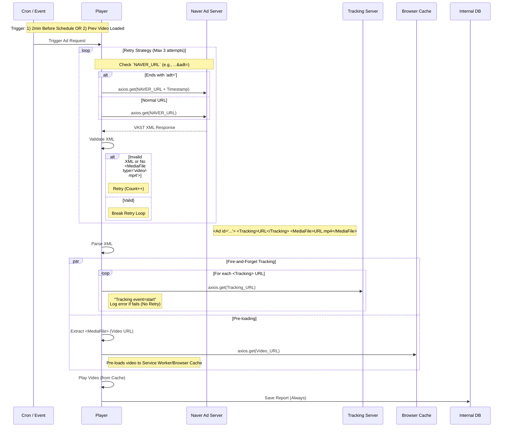

# Naver (`A`) Sequence Diagram

이 문서는 Naver VAST 연동(`HIVESTACK_YN: 'A'`)에 대한 상세 시퀀스 다이어그램을 포함합니다.

## Naver Integration Flow
- **특징**: 트래킹(Tracking)이 비디오 로딩 시점에 즉시 발생하며(`Fire-and-Forget`), 결과와 무관하게 DB에 저장됩니다.

### 호출 시점 (Trigger Points)
Naver 광고 요청(`getUrlFromNaver`)은 다음 두 가지 시점에 발생합니다.
1.  **스케줄링 (Cron)**: 단일 아이템 재생 시, 시작 시간 **2분 전**에 호출 (`cronVideo`).
2.  **연속 재생 (Pre-load)**: 현재 비디오 로딩(`loadeddata`) 직후, **다음 아이템**이 Naver 광고일 때 호출.

