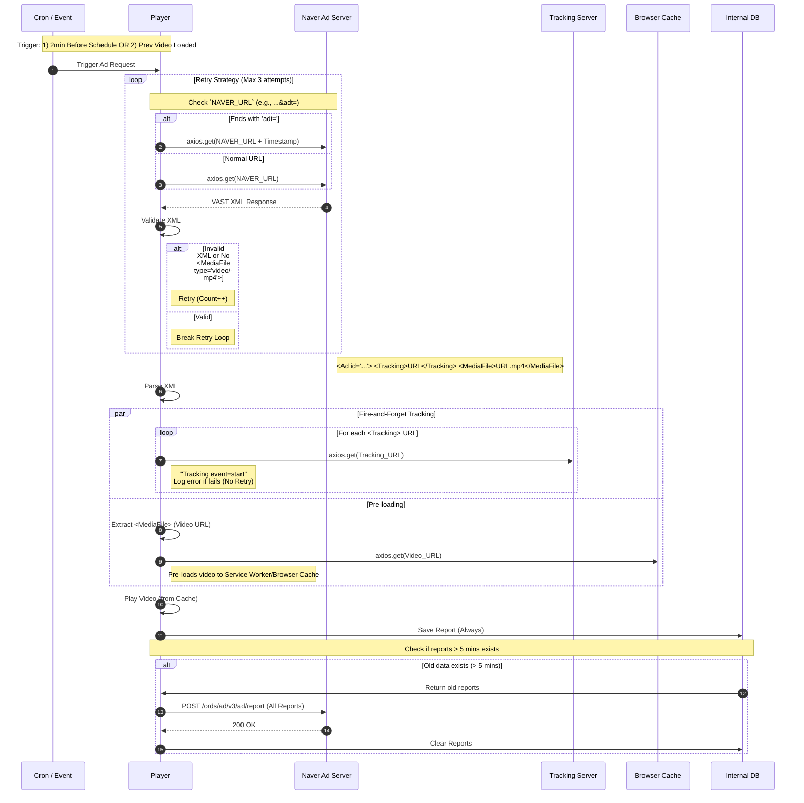

# Naver (`A`) Sequence Diagram

이 문서는 Naver VAST 연동(`HIVESTACK_YN: 'A'`)에 대한 상세 시퀀스 다이어그램을 포함합니다.

## Naver Integration Flow
- **특징**: 트래킹(Tracking)이 비디오 로딩 시점에 즉시 발생하며(`Fire-and-Forget`), 결과와 무관하게 DB에 저장됩니다.

### 호출 시점 (Trigger Points)
Naver 광고 요청(`getUrlFromNaver`)은 다음 두 가지 시점에 발생합니다.
1.  **스케줄링 (Cron)**: 단일 아이템 재생 시, 시작 시간 **2분 전**에 호출 (`cronVideo`).
2.  **연속 재생 (Pre-load)**: 현재 비디오 로딩(`loadeddata`) 직후, **다음 아이템**이 Naver 광고일 때 호출.

### 반영 로직
1.  **트래킹 (Fire-and-Forget)**: getUrlFromNaver 함수 내에서 XML 파싱 직후 비동기로 실행되며(axios.get), 실패 시 에러만 로그하고 진행합니다.
2.  **캐싱 (Pre-loading)**: player.js에서 호출하는 axios.get(videoUrl)은 sw.js의 fetch 이벤트 핸들러에 의해 VIDEO_CACHE_NAME 캐시에 저장되어, 이후 재생 시(player.src) 브라우저 캐시에서 로드됨을 확인했습니다 ("Play Video (from Cache)"의 기술적 근거).
3.  **재시도 로직**: 최대 3회 재귀 호출 구조를 다이어그램에 루프(Loop)로 반영했습니다.
4.  **트리거 시점**: 스케줄(2분 전)과 로드 데이터(Next Item) 시점을 명시했습니다.

